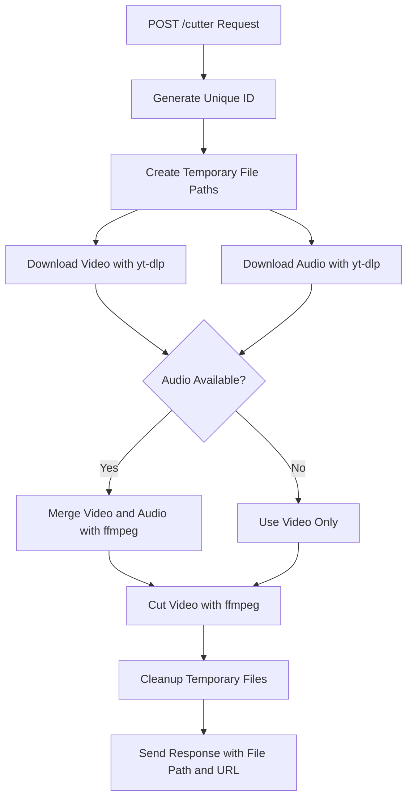

<p align="center">
  <a href="http://nestjs.com/" target="blank"></a>
</p>

  <p align="center">A progressive <a href="http://nodejs.org" target="_blank">Node.js</a> framework for building efficient and scalable server-side applications.</p>

## Description

This project is a content short generator built using the [NestJS](https://nestjs.com/) framework. It provides functionality to download, process, and cut video content, as well as clean up temporary files.

## Project Structure

The project is organized into the following modules and services:

### Modules
- **CutterModule**: Handles video downloading, merging, and cutting operations.
  - **CutterController**: Exposes an API endpoint to trigger the video cutting process.
  - **CutterService**: Implements the core logic for downloading, merging, and cutting videos.

### Services
- **CleanupService**: Periodically cleans up temporary files older than a specified duration.

### Main Application
- The main application (`src/main.ts`) sets up the server and serves static assets (videos) from the `/tmp` directory.

## API Endpoints

### CutterController
- **POST /cutter**
  - **Description**: Downloads a video from a given URL, cuts it based on the specified start and end times, and returns the file path.
  - **Request Body**:
    ```json
    {
      "url": "string",
      "start": "string (HH:MM:SS)",
      "end": "string (HH:MM:SS)"
    }
    ```
  - **Response**:
    ```json
    {
      "message": "🚀 Proses sedang berjalan...",
      "file": "string (local file path)",
      "url": "string (public URL)"
    }
    ```

### API Flow (Cutter)

The following diagram illustrates the detailed flow of the Cutter API:



## Setup

### Installation

```bash
$ npm install
```

### Running the Application

```bash
# Development mode
$ npm run start:dev

# Production mode
$ npm run start:prod
```

The application will run on `http://localhost:3001`.

### Static Assets
- Videos are served from the `/tmp` directory under the `/videos` prefix.

## Testing

### Unit Tests
```bash
$ npm run test
```

### End-to-End Tests
```bash
$ npm run test:e2e
```

### Test Coverage
```bash
$ npm run test:cov
```

## Cleanup Service

The `CleanupService` automatically deletes temporary files in the `/tmp` directory that are older than 60 minutes. This service runs every 10 minutes.

## Dependencies

Key dependencies used in this project:
- `yt-dlp`: For downloading video and audio content.
- `ffmpeg`: For merging and cutting video files.
- `@nestjs/common`, `@nestjs/core`: Core NestJS framework modules.

## Development Notes

### Temporary Directory
- The application uses a `tmp` directory in the project root for storing temporary files. Ensure this directory exists and is writable.

### Environment
- The application is configured to run on Node.js 16+.

## License

This project is [UNLICENSED](LICENSE).
